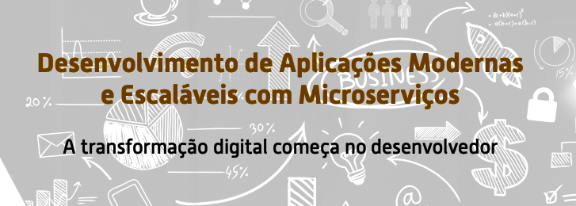
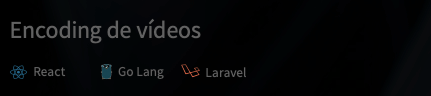

<h2 align="center"> 
	Microservices by 
  <a href="https://code.education/">Code Education</a>
</h2>
<h1 align="center">
    
</h1>

<h4 align="center"> 
	Developing modern and scalable applications with microservices  
  The digital transformation begin at the developer 
</h4>

  

  

  

## 📝 Project
In this training we'll develop an application like Netflix, where the user will be able to create an account, to make a subscription, look for a movie and watch them.
### 💻 Features
We are going to develop the following microservices:
* Authentication Single Sign On:  
  

* User Subscription:  
  

* Search:  
  

* Video Catalog:  
  

* Encoding videos:  
  

## Status
🚧 In development

## Technologies and content
* Software Architecture
  - SOLID
  - DDD
  - Microservice architecture
  - Monolitic architecture
  - Microservice communication types
* Devops
  - Git flow
  - Docker
  - Kubernetes
  - CI/CD
* Programming languages
  - Golang
  - Nodejs
  - PHP (Laravel)
  - React
* Messaging Queues
  - RabbitMQ
  - Kafka
* Databases
  - Redis
  - MySQL
  - Elastic Search

## Extras
In this repo, you will find the module challenges that I did during the course.